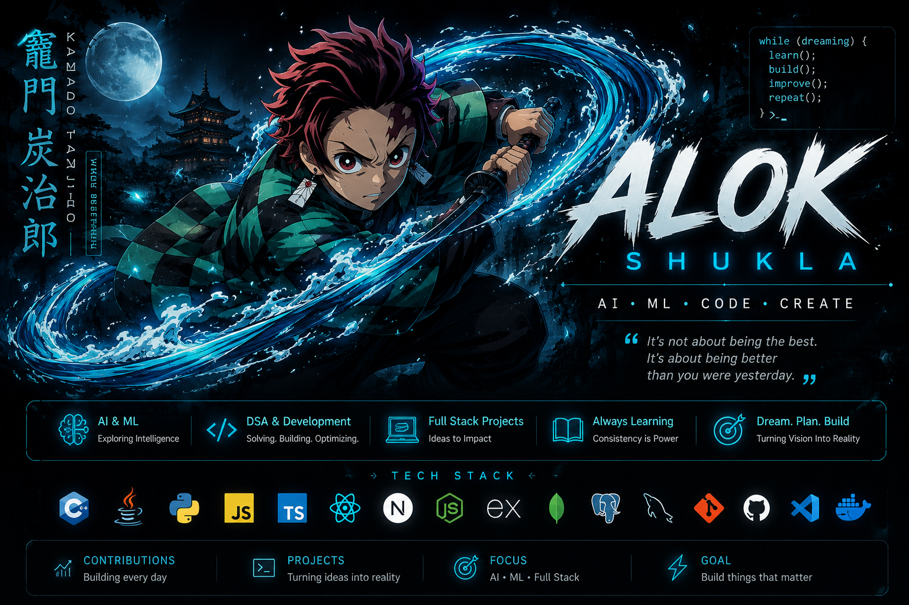

<div align="center">


</div>

<br>

<div align="center">

# ⚡ A L O K &nbsp; S H U K L A ⚡


<br>


</div>

---
<div align="center">

## 👨‍💻 ABOUT ME

</div>

```yaml
Alok Shukla
━━━━━━━━━━━━━━━━━━━━━━━━━━━━━━━━━━━━━━

🎓  B.Tech CSE — AI & Machine Learning
🧠  Exploring Artificial Intelligence
💻  Building projects & learning by doing
⚡  Currently improving DSA & development
🚀  Goal: Build things that actually matter
📍  India

```

---
---

<div align="center">

## ⚡ TECH ARSENAL

### Languages


### Development & Tools


### Currently Exploring


<br>

`AI/ML` • `DSA` • `Full Stack Development` • `Open Source`

</div>

---
<div align="center">


<div align="center">

## 🐍 CONTRIBUTION SNAKE


</div>

---
<div align="center">

## ⚡ GITHUB STATS


<br><br>


</div>

---
<div align="center">

## 📈 ACTIVITY MATRIX


</div>

---
<div align="center">

## 🚀 FEATURED PROJECTS

</div>

### 🐾 Animal Allies
> **A platform built to support animal welfare & connect people who want to help.**

`HTML` • `CSS` • `JavaScript` • `Node.js`

🔹 Built with a focus on real-world impact  
🔹 Interactive and responsive interface  
🔹 One of my early full-stack development projects  

---

### 💙 More Projects Loading...

```text
[ SYSTEM ] Scanning repositories...
[ ███████████████░░░░░ ] 75%

> Building.
> Experimenting.
> Breaking things.
> Learning.
> Repeating.
---
```

<div align="center">

## 🌐 CONNECT WITH ME

<a href="https://github.com/Alok2709-dev">

</a>
&nbsp;
<a href="https://www.linkedin.com/in/alok-shukla-ba6abb319/">

</a>

<br><br>


<br><br>

⚡ **Code • Create • Learn • Repeat**

</div>
